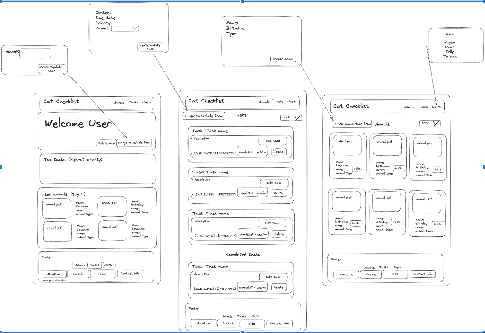

## Petsthetics 
Pawrioritise Like a Pro!

## Project description

The backend API our team received was the Animal Task Manager project by the Cat_Cheklist group. The task manager allows the user to input their animals as well as the tasks associated with each pet.

As a team, Petsthetics, decided to focus on making sure that the functionalities for the front-end included having a Pet, task and user List, in addition to being able to create and delete a user.

## Wireframe

For the wireframe we decided on a single page application. There is a navbar for the drop-down list of users, which enables switching between users. There is also a welcome message that changes with the selected user.  </li>

## Animal container

There is a list of current user animals and a form to create new animals. There are buttons to delete animals.

## Task List

There is a list of tasks and completed tasks. Once the checkbox is ticked, the task moves to the completed task list. There is also a form to create a new task. There are buttons to delete tasks.

## Components Diagram

From the API, most of the data revolves around the animal class, which stems from the user class, and from this we fetched the information from the user in the user container. The user container feeds into the user related components and the animal container,  and the animal container supplys data to the rest of the components related to the animal, and the tasks.   

# Tech Stack
<ul>
    <li>React</li>
    <li>JSX</li>
    <li>HTML</li>
    <li>CSS</li>
    <li>Visual Studio Code</li>
</ul>

## Set Up 

Ensure the following are installed on your machine:
<ul>
<li>Visual Studio Code</li>
<li>Intellij IDEA (JDK 17)</li>
<li>PostgreSQL</li>
<li>Postico</li>
<li>Postman</li>
</ul>

Back End Api link: https://github.com/HayanButt/Cat_Checklist_BackEnd_GroupProject
Front End link: https://github.com/HayanButt/BNTA_Frontend_Project

Clone the API repository from GitHub. 

Scroll to the top of this page and click on the green Code button. 

Ensure SSH is selected and copy the link provided. In your terminal, perform the following command:
  <pre><code>git clone git@github.com:HayanButt/Cat_Checklist_BackEnd_GroupProject.git</code></pre> </li>

Create a new PostgreSQL database named 'Cat_Checklist' anywhere in your terminal.
  <pre> <code>createdb Cat_Checklist </code></pre>

Via Intellij IDEA, run the CatChecklistApiApplication and make sure the API is running on port 8080.

Clone the Front End repository from GitHub. 

Scroll to the top of this page and click on the green Code button. 

Ensure SSH is selected and copy the link provided. 

In your terminal, perform the following command:
  <pre><code>git clone git@github.com:HayanButt/BNTA_Frontend_Project.git</code></pre> 

Via terminal ensure you're in the correct folder for the Front End project and type 
<pre><code>npm i</code></pre>
to install the node modules. After it is installed, type 
<pre><code>npm start</code></pre>
to start the app up on localhost:3000

## Diagram

## MVP and Extensions
### MVP
* To ensure the pet checklist form enables CRUD functionality from the back-end API (Select/Create/Delete/Edit User, Add/Delete Pet, Add/Delete Tasks)

### Extensions
* Checkboxes for completed tasks
* Dynamic buttons with audio
* Footer
* Show and hide form buttons

### Possible Extensions
* Change background colour depending on priority e.g. red for HIGH
* Sort function for task list, e.g. by priority or due date
* Reactive design, resizing for mobile devices
* Burger menu when the screen is small for the nav bar
* More functionality in the footer

## Collaborators
<ul>
    <li>Hayan Butt (GitHub: HayanButt) </li>
    <li>Kelly Wong (GitHub: KKLW97)</li>
    <li>Taliane Moussassa (GitHub: TalianeM)</li>
    <li>Umar Farid William Twynam (GitHub: ufwtwynam) </li>
</ul>
